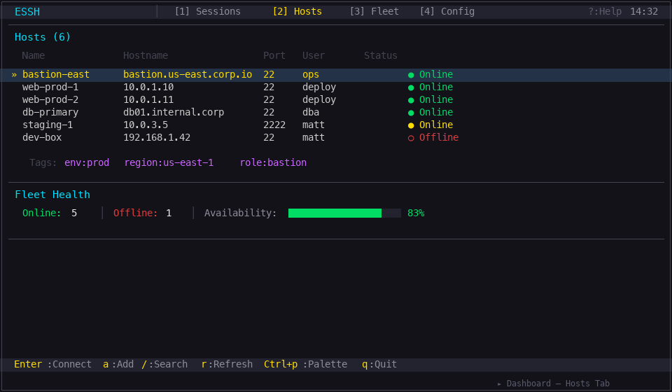

<p align="center">

```
                         ███████╗███████╗███████╗██╗  ██╗
                         ██╔════╝██╔════╝██╔════╝██║  ██║
                         █████╗  ███████╗███████╗███████║
                         ██╔══╝  ╚════██║╚════██║██╔══██║
                         ███████╗███████║███████║██║  ██║
                         ╚══════╝╚══════╝╚══════╝╚═╝  ╚═╝
                           Enhanced SSH for people with fleets
```

</p>

<p align="center">
  <a href="https://crates.io/crates/essh"></a>
  <a href="https://github.com/matthart1983/essh/actions/workflows/ci.yml"></a>
  <a href="https://github.com/matthart1983/essh/blob/main/LICENSE"></a>
</p>

<p align="center">
  <b>One terminal. Multiple SSH sessions. Live host insight. Zero context switching.</b>
</p>

<p align="center">
  ESSH is a pure-Rust SSH client with a sharp, Netwatch-inspired TUI for operators who want more than a bare shell.<br>
  Connect fast, watch host health in real time, move files, manage forwards, and keep a clean audit trail without leaving the terminal.
</p>

---

## Why ESSH

Most SSH tools stop at "you are connected." ESSH is built for what happens after that.

- Work across multiple hosts without juggling terminal windows.
- See CPU, memory, disks, network, and process pressure while you are on the box.
- Keep connection diagnostics, recordings, file transfer, and port forwarding in the same workflow.
- Stay in a terminal-first interface that feels fast, dense, and operational.

ESSH is for people who manage real systems and want their SSH client to act like an operations tool, not just a transport.

---

## What Makes It Hit

| Pillar | What You Get |
|---|---|
| **Fleet-first workflow** | Browse hosts, filter by tag, jump between sessions, and fan commands across groups from one place. |
| **Live machine awareness** | Built-in host monitor shows CPU, memory, disk, load, network throughput, and top processes in real time. |
| **Operational depth** | Port forwarding, file transfer, jump hosts, notifications, recordings, reconnects, and audit logs are part of the product, not bolted on later. |
| **Pure-Rust stack** | Built on [`russh`](https://github.com/warp-tech/russh), [`ratatui`](https://github.com/ratatui/ratatui), and [`vt100`](https://github.com/doy/vt100-rs) with no OpenSSH UI dependency. |

---

## Demo



<p align="center">
  <sub>Dashboard, multi-session terminal, host monitor, split pane, command palette, file browser, and port forwarding in one flow.</sub>
</p>

---

## Install Fast

ESSH currently supports macOS and Linux builds only.

### crates.io

```bash
cargo install essh
```

### from source

```bash
git clone https://github.com/matthart1983/essh.git
cd essh
cargo build --release
./target/release/essh
```

Windows is not a supported local build target at this time.

---

## First 60 Seconds

```bash
# Launch the dashboard
essh

# Direct connect
essh connect user@host

# Use a specific key
essh connect user@host -i ~/.ssh/id_ed25519

# Use an encrypted key (ESSH will prompt for the passphrase)
essh connect user@host -i ~/.ssh/id_ed25519_encrypted

# Pull hosts from your existing SSH config
essh hosts import

# Run a command across a tagged group
essh run web-servers -- uptime
```

On first launch, ESSH creates `~/.essh/` and gives you a working config, SQLite host cache, diagnostics directory, and audit log path.

---

## The Product In One Screen

```text
┌─ ESSH ── [1] web-prod  [2] db-primary  [3] staging ───────────────┐
│ deploy@web-prod:~$                                                │
│                                                                   │
│   journalctl -u api -f                                            │
│                                                                   │
├───────────────────────────────────────────────────────────────────┤
│ RTT 12.3ms   ↑1.2KB/s   ↓48.5KB/s   Loss 0.0%   ● Excellent       │
├───────────────────────────────────────────────────────────────────┤
│ CPU  23%  ▁▂▃▄▅▆▅▃▂▁     MEM  40%  ████████████████░░░░░░░░░       │
│ LOAD 0.82 0.64 0.55      NET  RX 48.5KB/s   TX 1.2KB/s            │
│ DISK / 62%               Top: node, nginx, postgres               │
└───────────────────────────────────────────────────────────────────┘
```

The idea is simple: terminal fidelity when you need a shell, operational signal when you need context.

---

## Feature Highlights

### Multi-Session Without the Mess

- Up to 9 concurrent SSH sessions.
- Instant switching with `Alt+1-9`, `Alt+←/→`, and `Alt+Tab`.
- Split-pane terminal plus host monitor with `Alt+s`.
- Scrollback preserved across reconnects.

### Remote Insight Without an Agent

- CPU, memory, load, disk, network, uptime, and top processes.
- Sparkline history and bar gauges tuned for quick scanning.
- Collected over SSH exec channels, so there is nothing extra to install remotely.

### Fleet Features That Actually Matter

- Import hosts from `~/.ssh/config`.
- Tag hosts and define groups.
- Run commands across a group with parallel fan-out.
- Background fleet probes with latency history and color-coded state.

### Built For Real SSH Work

- Public key, password, and SSH agent auth.
- Encrypted OpenSSH private keys with interactive passphrase prompts.
- TOFU host key verification with `strict`, `prompt`, and `auto` modes.
- Five built-in themes with instant switching and persisted preferences.
- Jump host / ProxyJump support.
- Local port forwards, live add and remove.
- Two-pane file browser for upload and download.

### Built-In Safety Nets

- Exponential backoff reconnects.
- Structured JSON audit log.
- Session diagnostics written as JSONL.
- Optional asciicast v2 recording and replay.
- Regex-based background notifications for important output.

---

## Ease Of Use, Not Ceremony

### Import what you already have

```bash
essh hosts import
```

### Use encrypted private keys

ESSH supports passphrase-protected private keys for both direct CLI connections and the TUI.

```bash
# One-off CLI connection with an encrypted key
essh connect user@host -i ~/.ssh/id_ed25519_encrypted

# Add an encrypted key to the local key cache
essh keys add ~/.ssh/id_ed25519_encrypted --name laptop-key
```

What to expect:

- If the key is encrypted, ESSH prompts for the key passphrase and then continues the connection.
- Saved hosts in the TUI behave the same way: selecting a host that uses an encrypted key will prompt for the passphrase when needed.
- Jump-host connections and group runs also honor encrypted keys.
- If you prefer to avoid repeated prompts, loading the key into `ssh-agent` still works.

### Bring structure to a messy fleet

```toml
[[hosts]]
name = "web-prod-1"
hostname = "10.0.1.10"
user = "deploy"
key = "~/.ssh/id_ed25519"

[hosts.tags]
env = "production"
role = "web"

[[host_groups]]
name = "web-servers"

[host_groups.match_tags]
role = "web"
```

### Run a fleet command without leaving the toolchain

```bash
essh run web-servers -- sudo systemctl status nginx
```

### Replay what happened later

```bash
essh session list
essh session replay <session-id>
```

---

## Keyboard Flow

### Global

| Key | Action |
|---|---|
| `?` / `Alt+h` | Help overlay |
| `Alt+1` - `Alt+9` | Jump to session |
| `Alt+←` / `Alt+→` | Cycle sessions |
| `Alt+Tab` | Last-used session |
| `Ctrl+p` | Command palette |
| `Alt+t` | Cycle theme |
| `Alt+d` | Detach to dashboard |
| `Alt+w` | Close session |

### Session Ops

| Key | Action |
|---|---|
| `Alt+m` | Host monitor |
| `Alt+s` | Split pane |
| `Alt+[` / `Alt+]` | Resize split |
| `Alt+f` | File browser |
| `Alt+p` | Port forwarding |
| `Alt+r` | Rename tab |

### Dashboard

| Key | Action |
|---|---|
| `1` - `4` | Switch tabs |
| `j` / `k` / `↑` / `↓` | Navigate hosts |
| `Enter` | Connect |
| `/` | Live filter |
| `a` | Add host |
| `d` | Delete host |
| `r` | Refresh |
| `t` | Cycle theme |

---

## Themes

ESSH ships with the same built-in theme set as NetWatch: `dark`, `light`, `solarized`, `dracula`, and `nord`.

Use `t` on dashboard-style views or `Alt+t` from any session to cycle themes instantly. The selected theme is saved in `~/.essh/config.toml` as:

```toml
theme = "dark"
```

---

## CLI Cheat Sheet

```bash
essh                                  # launch dashboard
essh connect user@host                # direct SSH session
essh hosts list                       # list cached hosts
essh hosts import                     # import from ~/.ssh/config
essh keys list                        # list cached keys
essh diag <session-id>                # inspect diagnostics
essh session list                     # list recordings
essh session replay <session-id>      # replay a recording
essh audit tail --lines 20            # inspect recent audit events
essh config show                      # print active config
```

---

## Configuration

ESSH stores its state in `~/.essh/`.

```text
~/.essh/
├── config.toml      # main configuration
├── cache.db         # host and key cache
├── audit.log        # structured audit trail
├── sessions/        # per-session diagnostics logs
├── recordings/      # asciicast recordings
└── known_cas/       # trusted certificate authorities
```

Useful commands:

```bash
essh config init
essh config edit
essh config show
```

If you want the full configuration and architecture spec, see [SPEC.md](SPEC.md).

---

## Security

- Host keys are verified and cached.
- TOFU policy is configurable: `strict`, `prompt`, or `auto`.
- Allowed ciphers and KEX algorithms can be restricted.
- Audit events are written as structured JSON.
- Session diagnostics and recordings are explicit, inspectable artifacts.

ESSH is built to give operators more visibility without hiding what the tool is doing on their behalf.

---

## Build And Validate

```bash
cargo build
cargo test
cargo clippy --all-targets --all-features -- -D warnings
cargo fmt --check
```

GitHub Actions runs the same core checks on pushes and pull requests to `main`.

---

## Contributing

Contributions are welcome.

1. Fork the repo.
2. Create a branch.
3. Make the change.
4. Run `cargo test`, `cargo clippy --all-targets --all-features -- -D warnings`, and `cargo fmt --check`.
5. Open a pull request.

---

## License

MIT. See [LICENSE](LICENSE).

---

<p align="center">
  <sub>ESSH is terminal-native SSH with a little more ambition.</sub>
</p>
